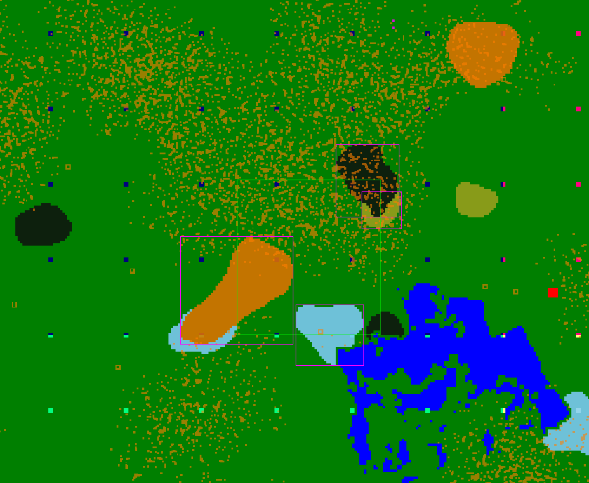
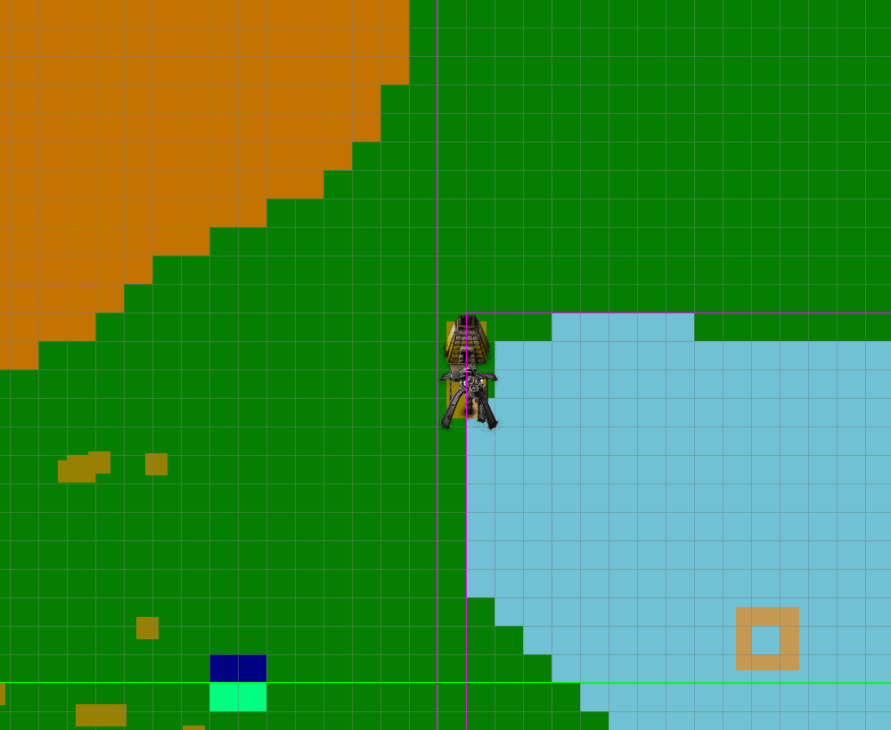

Factorio Bot
============

This project tries to be a **fair** bot/AI for the game
[Factorio](https://www.factorio.com) (version 0.15.37).

"Fair" means that the bot only uses information that is available to a human
player. Better planning algorithms or map memory is fine, but being able to
"see" yet-undiscovered parts of the map, or "looking through the fog of war"
is not considered "fair".

The project is in a **very early** stage, in fact, it's not much more than a
proof-of-concept that this can actually work.

Features right now:

  * we can read out the map / buildings on the map
  * most buildings are drawn, if you zoom in far enough
  * we can plan walking paths
  * we can actually walk :)
  * place entities
  * mine entities
  * craft recipes

Screenshots
-----------

Setup
------

Things are a bit fiddly right now. If you are on Linux, then there are various
helper scripts for you:

`./prepare.sh` will unpack three factorio installations (server and two
clients) and install the lua-part of the bot.

`./launch.sh --start/--stop/--run {server,Nayru,Farore}` will start/stop the
corresponding instance. `--run` will start, wait for `^C` and then stop.

`./launch.sh --bot` will start the bot.

If you're not on Linux, or if stuff doesn't work, read the internals below.

Usage
-----

Once the bot is running, you will see a map. Scroll with drag-and-drop, zoom
with mousewheel.

You can plan paths by first left-clicking the starting point, then
right-clicking the destination. Your character's location (which should
be the starting point) is denoted as a red dot on the map.

A path will show up in the map, and your Factorio player will start moving.

Some caveats

Note that only `game.players[1]` will move, i.e. the **first** player that has
ever joined the map since creation.

Note that drag-and-dropping the map will count as a start-selecting left
click. Also note that, when clicking a tile, you actually select its **top
left corner** as a destination/starting point.

Also note that the path shown is no longer the path the player actually walks.
This is because walking now creates a `WalkTo` goal, which internally plans
its own path, starting from the player's current position.

The `p` button switches between visualisation of the ore types and the ore-patch
ids.

Bugs / Limitations
------------------

Walking will appear really "jumpy" in the Factorio client which is being
"remote-controlled". A second player, following the remote-controlled one,
will not see anything jumpy.

Path planning will hang for a long time if no path can be found.

Building / Requirements
-----------------------

Most code is written in C++, using the C++14 standard. Dependencies are 
[Boost](http://boost.org) and [FLTK](http://fltk.org)-1.3.4 for the GUI. (On Ubuntu,
run: `apt-get install libboost-dev libfltk1.3-dev` to get them)

The build system used is Make. So just type `make all` and you should™ be
done.

This will create two executables: `rcon-client` with the obvious job, and
`test`, which is the bot program.

Internals
---------

How the communication between the bot and a factorio game instance works in detail
is explained [in this document](doc/factorio_comm.md).

Also, there's a detailed description of the [task scheduler](doc/scheduler.md).

License
=======

Copyright (c) 2017 Florian Jung (flo@windfisch.org)

*factorio-bot* is free software: you can redistribute it and/or
modify it under the terms of the **GNU General Public License,
version 3**, as published by the Free Software Foundation.

*factorio-bot* is distributed in the hope that it will be useful,
but WITHOUT ANY WARRANTY; without even the implied warranty of
MERCHANTABILITY or FITNESS FOR A PARTICULAR PURPOSE.  See the
GNU General Public License for more details.

You should have received a [copy of the GNU General Public License](LICENSE)
along with factorio-bot. If not, see <http://www.gnu.org/licenses/>.

Exceptions
----------

Note that some portions of the codebase are -- where explicitly noted in the
source files -- additionally licensed under the terms of the MIT license.

See also
========

Related to this is my [production flow optimizer project](https://github.com/Windfisch/production-flow).
